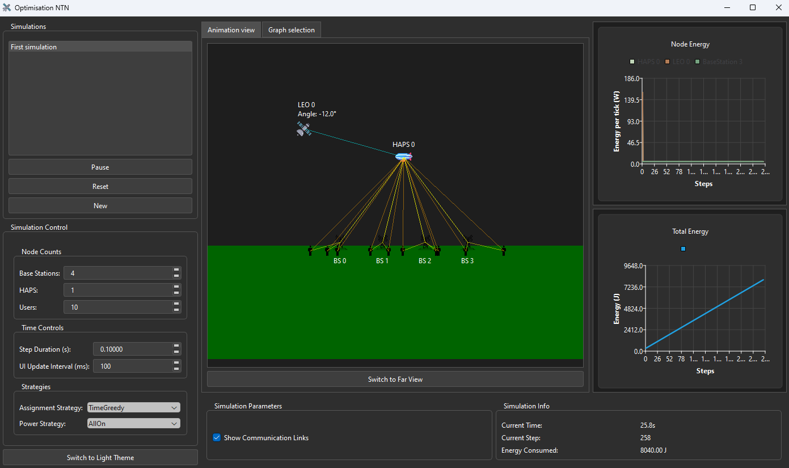

# NTN Optimization Simulation Package Installation and Usage Guide

## Installation

To install the package, clone the repository and install the package in development mode using pip:

```sh
# Clone the repository
git clone https://github.com/SimonR99/OptimisationNTN.git

# Navigate to the project directory
cd OptimisationNTN

# Create a virtual environment
python -m venv env

# Activate the virtual environment
source env/bin/activate (linux)
env\Scripts\activate (windows)

# Install the required packages
pip install -r requirements.txt

# Install the package in development mode
pip install -e .
```

## Running the Simulation

Once the package is installed, you can run the simulation using the following command:

```sh
python -m optimisation_ntn.main
```

This command will run the simulation with the default parameters. You can modify the parameters by passing them as arguments to the command. You can select which algorithm to use, the number of users, the power strategy, etc.


### Running with the user interface

To run the simulation with the user interface, use the following command:

```sh
python -m optimisation_ntn.gui
```

This command will start the real-time NTN optimization simulation GUI. In the app, you will be able to:

- Start, stop, and reset the simulation.
- Adjust the speed of the simulation in real time.
- View the current number of base stations, HAPS, and LEO satellites.
- Test multiple algorithms and compare their performance.





## Testing and Formatting

Before committing your changes, please run the following commands to ensure your code is formatted correctly and passes all tests:

```sh
black .
pytest
pylint ./src
```

- `black` : checks the code formatting.
- `pytest` : runs the tests.
- `pylint` : checks the code quality.
